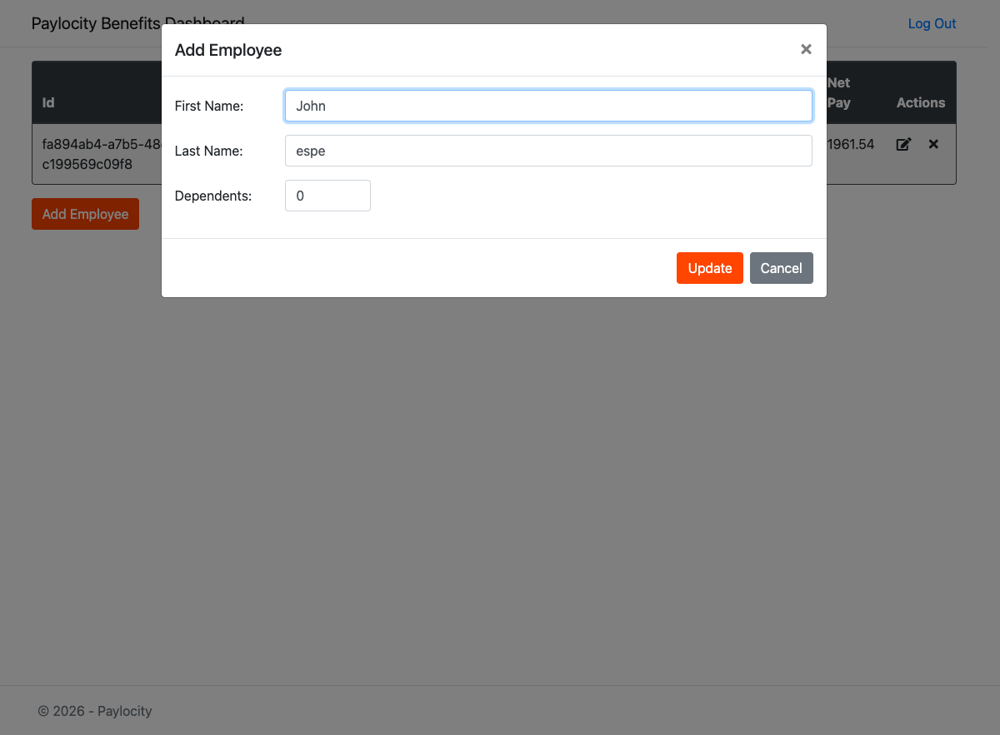
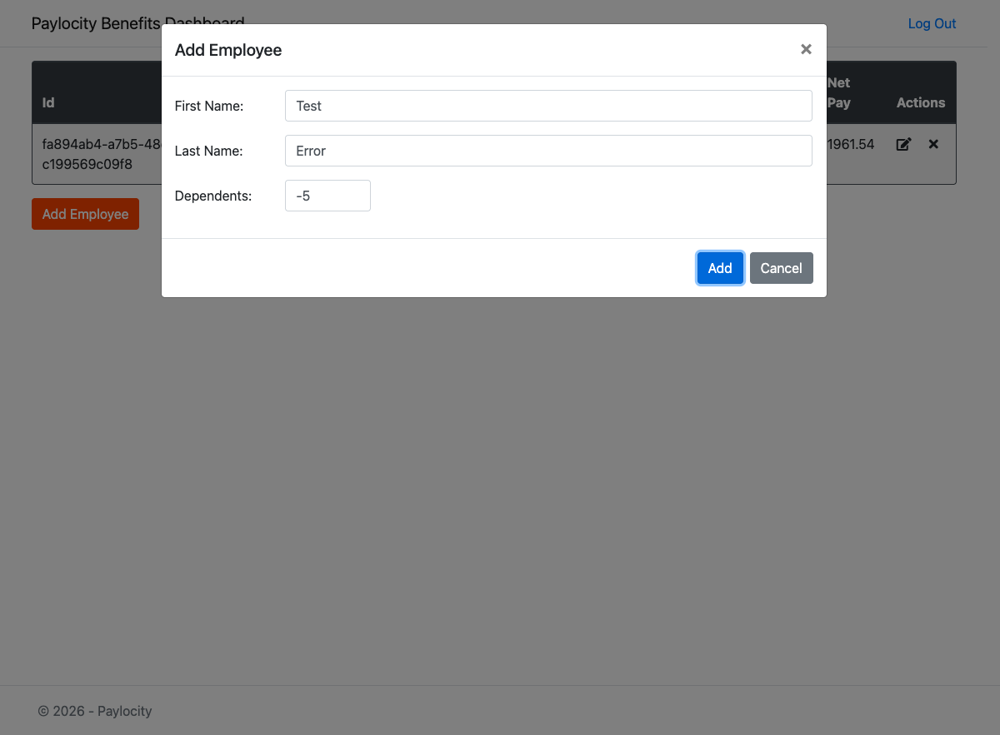
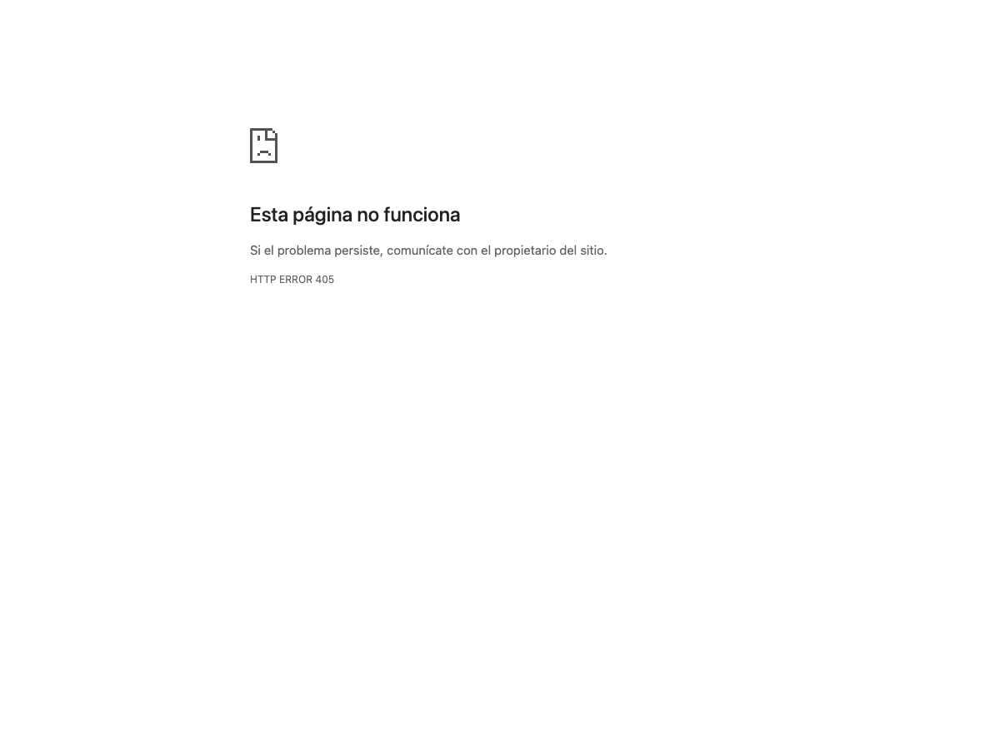
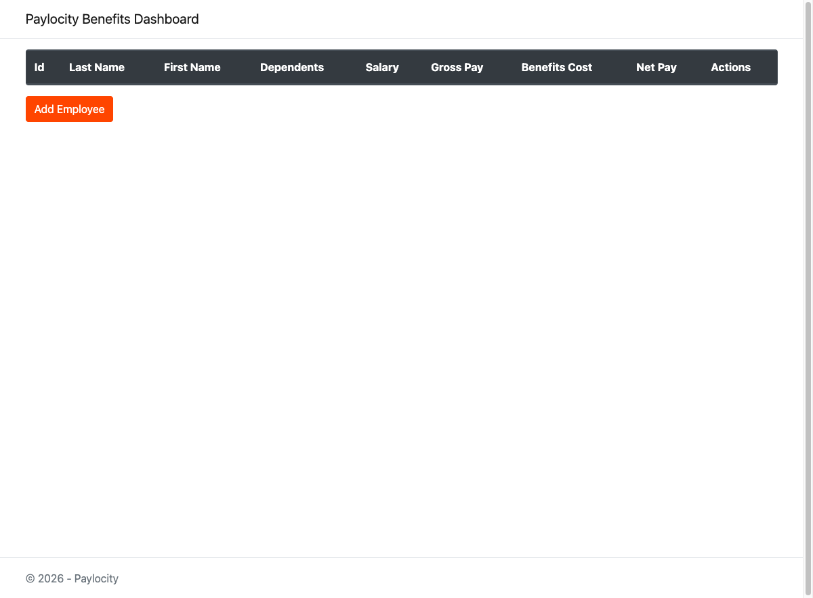
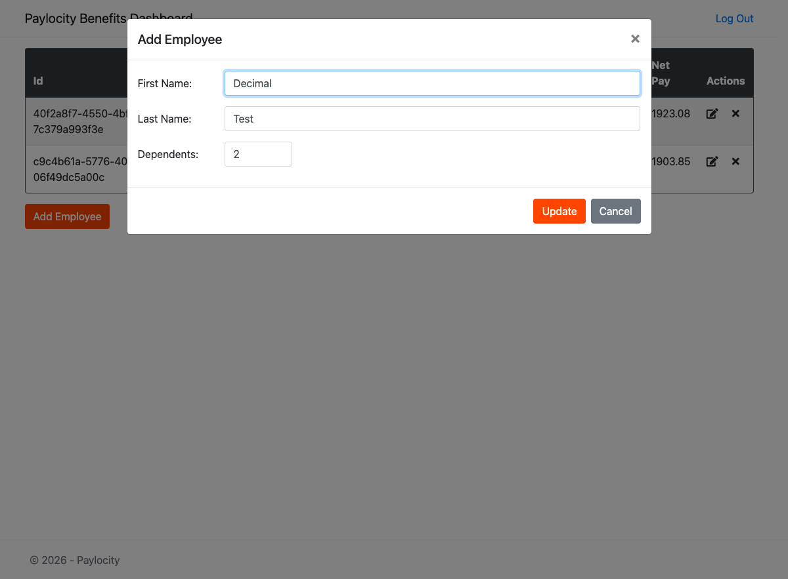
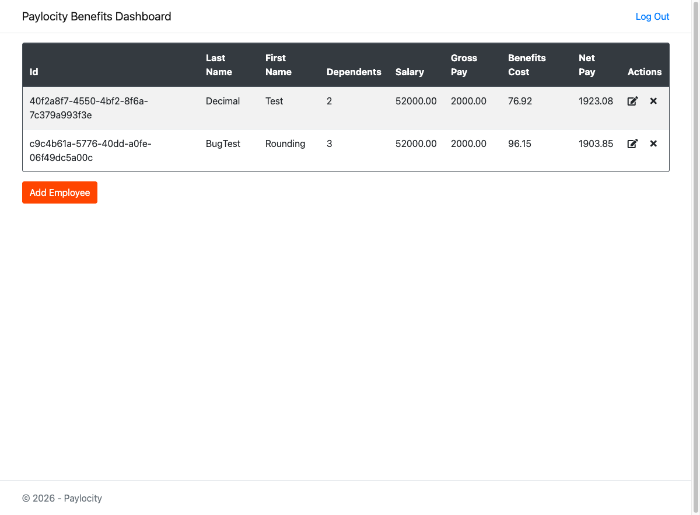

# Bug Report - Paylocity Benefits Dashboard

---

## BUG-001: Edit modal incorrectly displays "Add Employee" title instead of "Edit Employee" on Benefits Dashboard when editing any employee

### Steps to Reproduce

1. Log in to the application with valid credentials
2. Navigate to the Benefits Dashboard (`/Prod/Benefits`)
3. Locate any employee in the table
4. Click the edit icon (pencil) in the "Actions" column
5. Observe the modal title that opens

### Expected Result
- The modal should display the title **"Edit Employee"**
- The user should be able to clearly identify they are in edit mode
- The action button should say "Update" (this works correctly)

### Actual Result
- The modal displays the title **"Add Employee"** 
- Although the button correctly says "Update", the title causes confusion
- Employee data loads correctly in the form

### Error Screenshot

### Severity
**Medium** - UI/UX issue that causes confusion but does not prevent functionality

---

## BUG-002: Missing error feedback in Benefits Dashboard when submitting invalid employee data (negative dependents, empty required fields)

### Steps to Reproduce

1. Log in to the application
2. Click the "Add Employee" button
3. Enter invalid data:
   - **First Name:** Test
   - **Last Name:** Error
   - **Dependents:** -5 (negative number)
4. Click the "Add" button
5. Observe that no error message appears
6. Open the browser console (F12) to verify the server error

### Expected Result

- A clear and visible error message should be displayed to the user, for example:
  - "The number of dependents must be 0 or greater"
  - "Please enter a valid value"
  - "Error saving employee. Please verify the entered data"
- The message should appear in the modal or as a notification
- Fields with errors should be visually highlighted
- The modal should remain open to allow corrections
- The First Name input only accepts text 
- The Last Name input only accepts text
- The Dependents input only accepts positives numbers, including zero

### Actual Result

- No error message is displayed to the user
- The modal remains open without changes
- The "Add" button can be pressed repeatedly without feedback
- The error is only visible in the browser console: `Failed to load resource: the server responded with a status of 400`
- The user doesn't know if the employee was saved or not, nor what they did wrong
- The First Name input accepts negative, decial and special charters 
- The Last Name input accepts negative, decial and special charters
- The Dependents input accepts negative, decial and special charters

### Error Screenshot

### Severity
**High** - Significant impact on user experience. The user receives no feedback about errors.

---

## BUG-003: Application returns HTTP 405 error without user-friendly message on Login page when submitting invalid credentials

### Steps to Reproduce

1. Navigate to the Login page (`/Prod/Account/Login`)
2. Enter invalid credentials:
   - **Username:** InvalidUser123
   - **Password:** C{fjr$)KGY&% (or any password)
3. Click the "Log In" button
4. Observe the error page displayed

### Expected Result

- User should remain on the login page
- A clear error message should be displayed: "Invalid username or password"
- User should be able to retry login with correct credentials
- The application should handle authentication errors gracefully

### Actual Result

- Browser displays generic error page: "Esta página no funciona" (This page doesn't work)
- Shows **HTTP ERROR 405** (Method Not Allowed)
- No user-friendly error message
- User experience is completely broken - cannot retry login
- Technical error exposed to end user instead of proper error handling

### Error Screenshot

### Severity
**Critical** - Complete failure of login error handling. Exposes technical errors to users and prevents them from retrying.

---

## BUG-004: Unauthorized users can access Benefits Dashboard directly via URL without authentication

### Steps to Reproduce

1. Open a new browser window or incognito mode (ensure no active session)
2. Directly navigate to Benefits Dashboard URL: `/Prod/Benefits`
3. Observe that the dashboard loads successfully
4. Note that "Add Employee" button and all functionality are accessible

### Expected Result

- User should be redirected to the login page (`/Prod/Account/Login`)
- Dashboard should not be accessible without valid authentication
- All protected routes should enforce authentication
- Session validation should be required for accessing employee data

###  Actual Result

- Dashboard loads successfully without authentication
- All UI elements are visible (Add Employee button, table headers)
- No redirect to login page occurs
- Critical security vulnerability - unauthorized access to application

**Note:** While the API returns errors when trying to load employee data without authentication, the UI itself should not be accessible.

### Error Screenshot

### Severity
**Critical - Security Vulnerability** - Unauthorized users can access the application UI. This is a serious security flaw that must be fixed immediately.

---

## BUG-005: Missing input validation and error feedback when updating employee in Benefits Dashboard (accepts invalid data: negative dependents, empty fields, decimal values without warning)

### Steps to Reproduce

**Scenario A: Invalid Data (Negative/Empty)**
1. Log in to the application
2. Navigate to Benefits Dashboard with at least one existing employee
3. Click the edit icon (pencil) for any employee
4. Enter invalid data:
   - **First Name:** Clear the field (empty)
   - **Last Name:** Test
   - **Dependents:** -5 (negative number)
5. Click the "Update" button
6. Observe that no error message appears
7. Open the browser console (F12) to verify the server error

**Scenario B: Decimal Values**
1. Log in to the application
2. Navigate to Benefits Dashboard with at least one existing employee
3. Click the edit icon (pencil) for any employee
4. Change employee data:
   - **Dependents:** 2.7 (decimal value)
5. Click the "Update" button
6. Observe the employee updated in the table with value silently modified to 2

### Expected Result

**For Invalid Data (Scenario A):**
- A clear and visible error message should be displayed to the user, for example:
  - "The number of dependents must be 0 or greater"
  - "First Name is required"
  - "Please enter a valid value"
  - "Error updating employee. Please verify the entered data"
- The message should appear in the modal or as a notification
- Fields with errors should be visually highlighted
- The modal should remain open to allow corrections
- Input fields should enforce proper validation:
  - First Name: required, text only, cannot be empty
  - Last Name: required, text only, cannot be empty
  - Dependents: positive integers only (0 or greater)

**For Decimal Values (Scenario B):**
- **Option 1 (Preferred):** Reject decimal values
  - Display validation error: "Dependents must be a whole number"
  - Prevent form submission until corrected
- **Option 2:** Accept with explicit warning
  - Show warning message: "Value will be rounded to 2"
  - Ask for user confirmation before saving
  - Clearly indicate the rounding behavior

### Actual Result

**Scenario A: Invalid Data**
- No error message is displayed to the user
- The modal remains open without changes
- The "Update" button can be pressed repeatedly without feedback
- The error is only visible in the browser console: `Failed to load resource: the server responded with a status of 400`
- The user doesn't know if the employee was updated or not, nor what they did wrong
- Input fields accept invalid data:
  - First Name: accepts empty values, numbers, special characters
  - Last Name: accepts empty values, numbers, special characters
  - Dependents: accepts negative numbers, decimals, special characters

**Scenario B: Decimal Values**
- System accepts decimal value (2.7) without any warning
- Silently rounds/truncates the value to 2
- Employee is updated with modified value
- No notification to user about the data modification
- User is unaware their input was changed
- Benefits calculation is affected without user knowledge

### Error Screenshots

**Invalid Data:**

**Decimal Rounding:**

### Severity
**High** - Multiple validation issues during edit operations. User receives no feedback about errors, and data is silently modified without notification, causing poor UX and potential data integrity problems.

---

